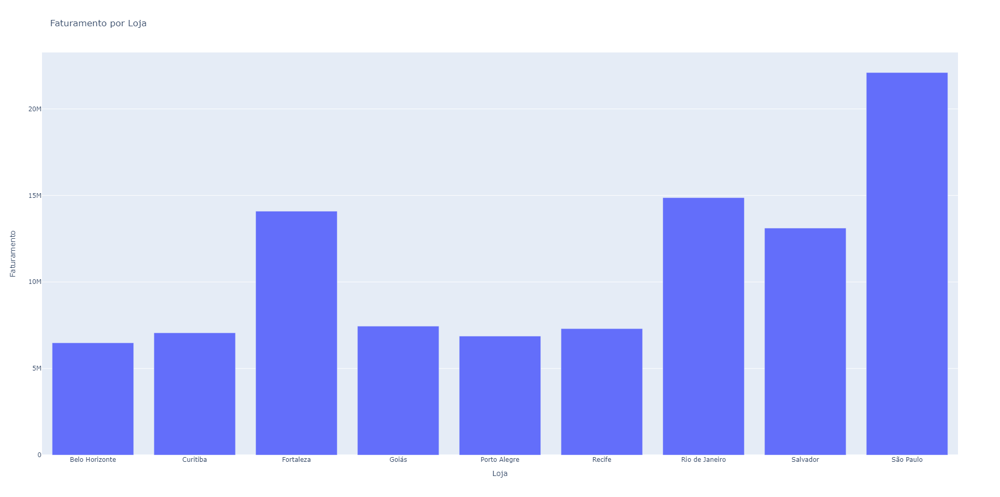

<h1 align="center"> For Payment System </h1>

  <a href="#-tecnologias">Tecnologias</a>&nbsp;&nbsp;&nbsp;|&nbsp;&nbsp;&nbsp;
  <a href="#-projeto">Projeto</a>&nbsp;&nbsp;&nbsp;|&nbsp;&nbsp;&nbsp;
  <a href="#-layout">Layout</a>&nbsp;&nbsp;&nbsp;|&nbsp;&nbsp;&nbsp;
  <a href="#memo-licença">Licença</a>

  

 

  

## 🚀 Tecnologias

Esse projeto foi desenvolvido com as seguintes tecnologias:

- PYTHON ()
- PANDAS ()
- PLOTLY EXPRESS()

## 💻 Projeto

Este é um projeto utilizando dados ficticiosos para estudo. Objetivo é fazer o tratamento dos dados, separar as planilhas(CVS) de vendas, colocando os produtos que mais venderam e as lojas com maior faturamento.

## 🌎 Linkedin
Você pode me encontrar no Linkedin, acesse meu perfil [Linkedin](https://www.linkedin.com/in/gustavo-luiz-medeiros/)

## :memo: Licença

Projeto desenvolvido para estudo, Gustavo Medeiros